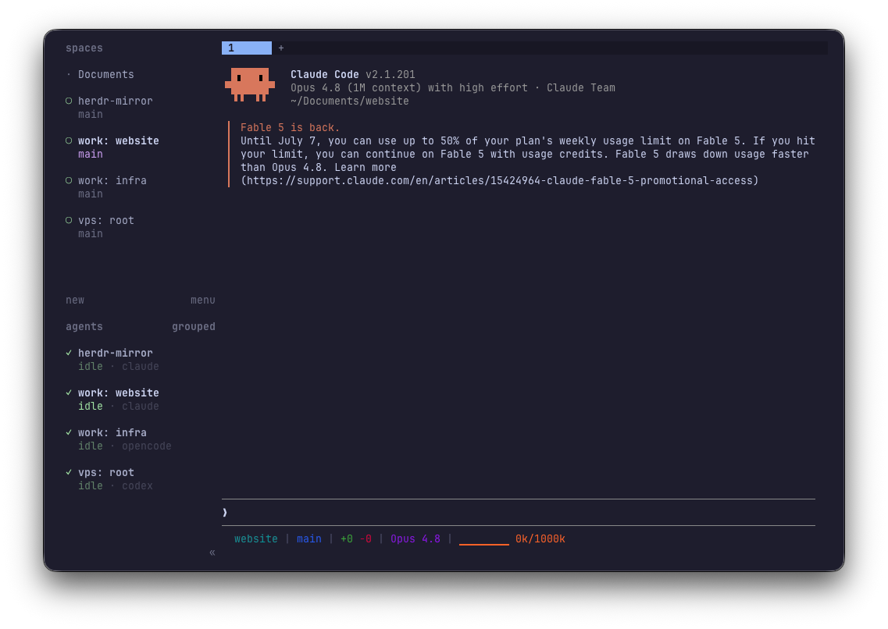

# herdr-mirror

A [herdr](https://herdr.dev) plugin that mirrors a remote herdr server's
workspaces and agents into your local sidebar. One window shows the agents on
every machine — blocked, working, done — with live pane content you can watch
and drive over ssh.

<p align="center">
  
</p>

Each remote workspace becomes a real local workspace named `<host>: <name>`.
Its panes stream the remote terminal live; its agents report their real state.
Mirroring is one-way (the remote needs no plugin — just herdr), but you can
type into any mirror pane to drive the remote session, and create remote
workspaces/tabs/panes from your side.

> **How it works.** One Rust binary (`herdr-mirror`) with subcommand modes: a
> `daemon` (control plane — reconciles remote workspaces into local mirrors
> and pushes agent status) and one `pane` process per mirror pane (data plane
> — streams the remote terminal over ssh).

## Requirements

- **Both machines**: herdr with the `terminal session` streams — preview build
  `2026-06-30` or newer (`herdr channel set preview`), until the next stable.
- **Local machine**: macOS or Linux on x86_64/aarch64 — install fetches the
  prebuilt binary from Releases (dev installs via `herdr plugin link` build
  from source with `cargo build --release`).
- **ssh**: non-interactive key auth to each remote
  (`ssh -o BatchMode=yes <host> true` must succeed without a prompt).

## Installation

```bash
herdr plugin install nikok6/herdr-mirror     # or: herdr plugin link <path>
```

Then create the config at `herdr plugin config-dir mirror`/`hosts.toml`
(usually `~/.config/herdr/plugins/config/mirror/hosts.toml`):

```toml
[hosts.work]
target = "work"        # anything ssh accepts: alias, user@host, ssh://host:2222
```

That's it — the daemon autostarts when you focus a workspace, so within a few
seconds `work: *` workspaces appear in your sidebar. Check state any time with
`herdr-mirror status`.

If you've disabled autostart, start the daemon yourself by keybinding the
"Mirror: start" action or running:

```bash
./target/release/herdr-mirror start
```

## Usage

**Drive** — the default (`always_control = true`) is tuned for headless remotes
(a vps, a server) with no window of their own: it keeps each mirror pane
writable and sized to your local pane, so the headless remote fills it instead
of showing a tiny default-sized window. Type and your keystrokes go to the
remote, tmux-style; the mouse wheel scrolls remote scrollback.

**Watch-only** — for a machine with its own display or a human sitting at it,
set `always_control = false` (globally or per host). Its mirrors become
read-only: a live view with zero effect on the remote that escalates to control
when you type and auto-releases after 1h idle (`ctrl+\` releases immediately).

**Close / restore** — by default, closing a mirror (`prefix+x`) also closes the
pane/workspace on the remote (`close_remote_on_local_close`; set it false to
only stop mirroring and leave the remote — and its agent — running). When the
remote is left running, the **restore** action (`herdr-mirror restore`) brings
back mirrors you closed.

**Pause** — the **pause** action halts syncing; mirrors stay frozen in place
and resume with **start**. `teardown` closes all mirrors and clears state.

**Create on the remote** — four actions create objects on the remote host,
inheriting the target host and cwd from the mirror you invoke them from (the
same rule as native `prefix+shift+n`, across ssh): `remote-new-workspace`,
`remote-new-tab`, `remote-split-right`, `remote-split-down`. The new object
mirrors back within seconds.

**Continuous streaming** — every mirror pane streams its remote pane live for
its whole lifetime, each over its own direct ssh connection, so panes are never
blank and a busy pane can't contend with or drop another's stream. Sidebar
agent status is daemon-driven, not stream-derived, so every agent's state stays
live regardless of what any stream is doing.

### Keybinds

Actions have no default keys; bind them in `~/.config/herdr/config.toml`, then
`herdr server reload-config`:

```toml
[[keys.command]]
key = "prefix+shift+m"
type = "plugin_action"
command = "mirror.start"       # start / resume the daemon

[[keys.command]]
key = "prefix+shift+s"
type = "plugin_action"
command = "mirror.pause"       # freeze syncing; start again to resume

[[keys.command]]
key = "prefix+shift+b"         # "bring back" (shift+r is native reload_config)
type = "plugin_action"
command = "mirror.restore"     # un-close mirrors you closed locally

# Create objects on the REMOTE host — run these from inside a mirror pane, which
# supplies the target host and cwd. Each is herdr's native local key + alt
# (Option): same muscle memory, but it acts on the remote over ssh.
[[keys.command]]
key = "prefix+alt+n"           # native new_workspace = prefix+shift+n
type = "plugin_action"
command = "mirror.remote-new-workspace"

[[keys.command]]
key = "prefix+alt+c"           # native new_tab = prefix+c
type = "plugin_action"
command = "mirror.remote-new-tab"

[[keys.command]]
key = "prefix+alt+v"           # native split_vertical = prefix+v
type = "plugin_action"
command = "mirror.remote-split-right"

[[keys.command]]
key = "prefix+alt+minus"       # native split_horizontal = prefix+minus
type = "plugin_action"
command = "mirror.remote-split-down"
```

The `remote-*` actions need a focused mirror pane (except `remote-new-workspace`,
which falls back to `default_host` when run outside one). The remaining
actions — `mirror.status`, `mirror.once`, `mirror.teardown`, `mirror.ensure` —
are lifecycle/diagnostic and are usually run from the CLI rather than bound.

## Configuration

`hosts.toml`:

```toml
# autostart = true       # focusing a workspace starts the daemon (default).
                         # A manual pause is sticky until you start again;
                         # a crash still auto-recovers on next focus.
# poll_seconds = 60      # reconcile poll interval (events drive most syncs)
# default_host = "work"  # host that "new remote workspace" targets when
                         # invoked outside any mirror (default: first host)
# close_remote_on_local_close = true
                         # default. Closing a mirror pane/workspace locally
                         # (e.g. prefix+x) also closes it on the remote. Set
                         # false to only stop mirroring on a local close,
                         # leaving the remote pane and its agent running.
# always_control = true  # default. Mirror panes stay in control: writable, no
                         # idle release, and sized to your local pane so the
                         # remote fills it (ideal for headless remotes). Set
                         # false for read-only mirrors that escalate on type.

[hosts.work]
target = "work"
# prefix = "work"                    # sidebar prefix (default: the host key)
# remote_bin = "~/.local/bin/herdr"  # remote path if it's not on ssh's PATH
# always_control = false             # per-host override, e.g. a host you use
                                     # directly (don't drive its pane sizes)
# enabled = true                     # false stops syncing this host without
                                     # deleting its config; mirrors stay put

[hosts.vps]                          # add more hosts freely; each is independent
target = "ssh://niko@203.0.113.7:2222"
```

## Limitations

- **Version-locked to preview** until the `terminal session` streams reach
  stable; keep both machines on the same build.
- **Latency** above raw ssh: keystroke echo is a rendered frame round-trip, so
  there's a small constant delay. For latency-critical work, plain `ssh <host>`
  is always one command away.
- **Layout geometry is copied, not linked**: pane content and typing are
  always live — only sizes are a snapshot. Remote pane adds/removes reconcile,
  but a split-ratio change at the remote doesn't resize an existing mirror.
- **No git status on mirror rows** — herdr derives the sidebar git branch and
  ahead/behind from the local workspace cwd, and there's no API to feed it a
  remote repo's state, so mirror workspaces show no git chip. The remote's real
  branch and status stay visible in the streamed pane's prompt.
- **No custom sidebar UI** (plugin API limitation): mirrors carry a `<host>: `
  label prefix and the daemon keeps them ordered into per-host groups, but it
  can't render a richer affordance (group headers, collapse, colour).
- **Remote must be reachable and running herdr**; the daemon surfaces a
  readable status if a host is down or on too old a version.

## License

MIT — see [LICENSE](./LICENSE).
